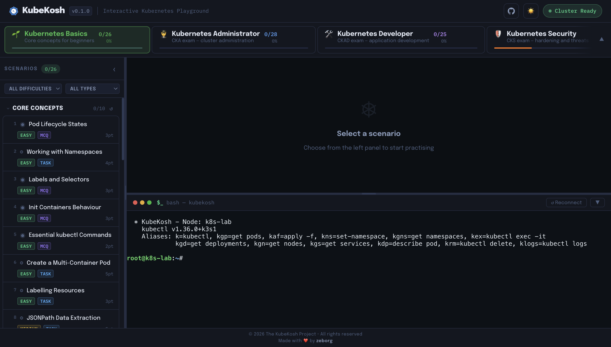
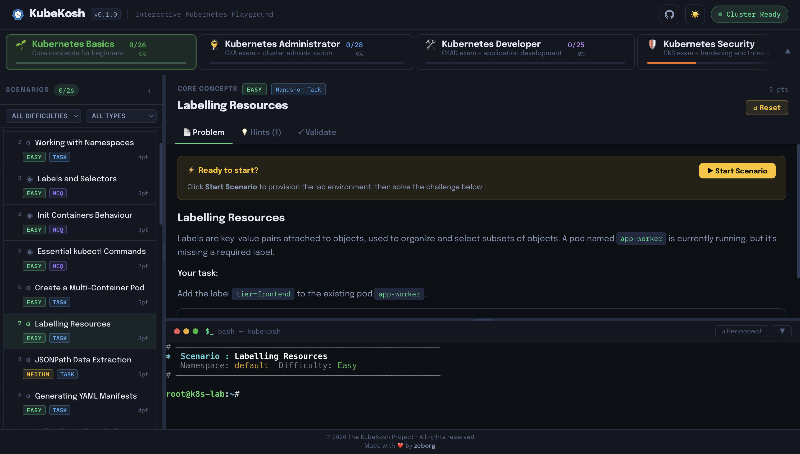
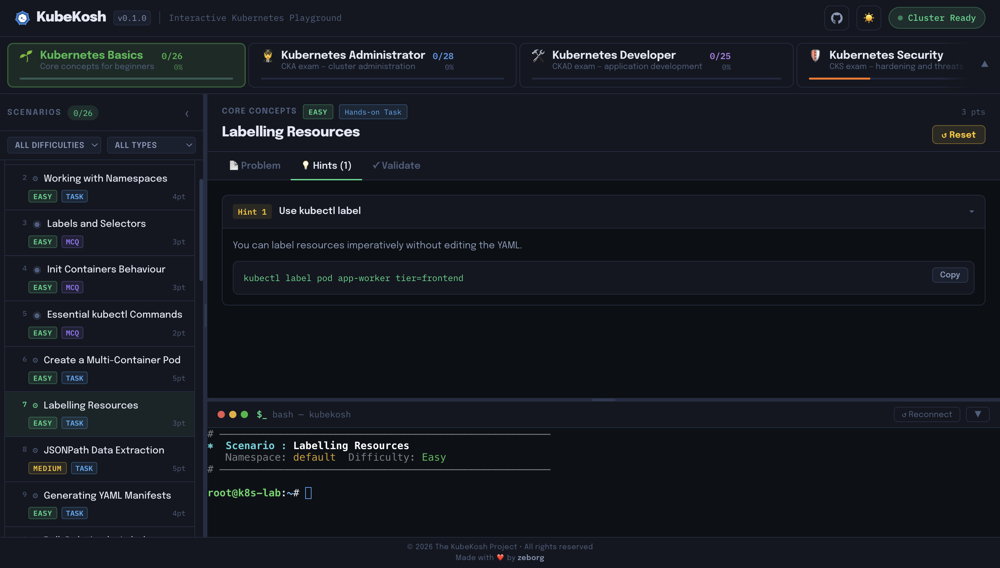
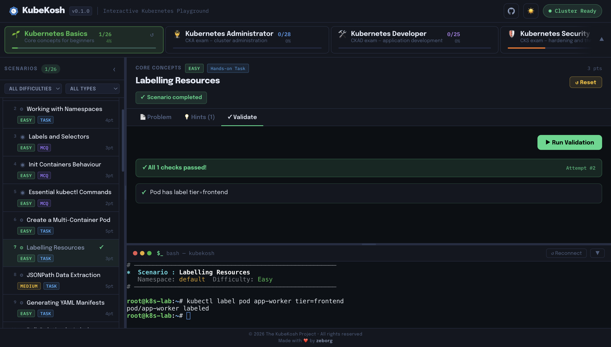
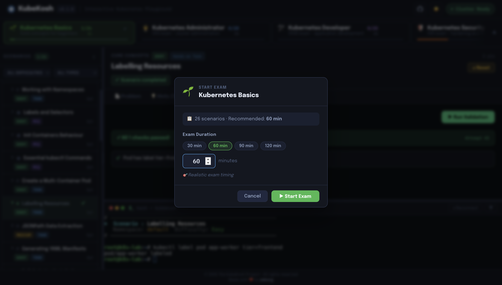
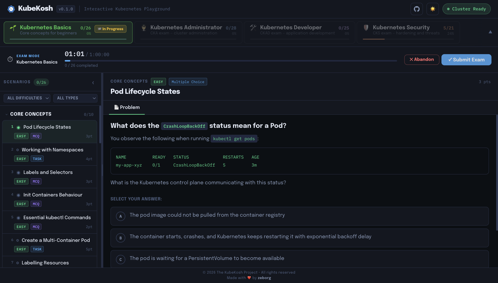
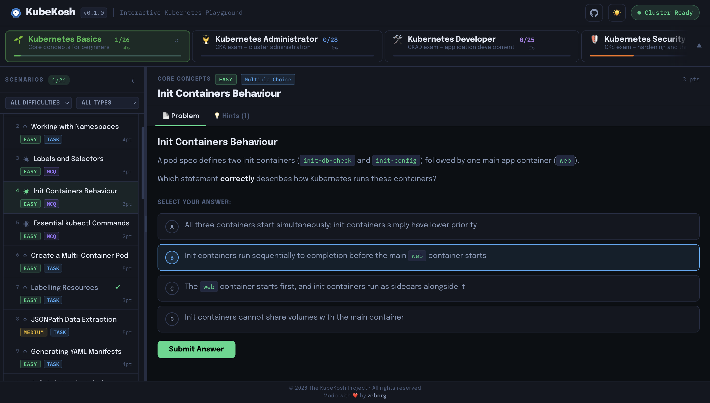
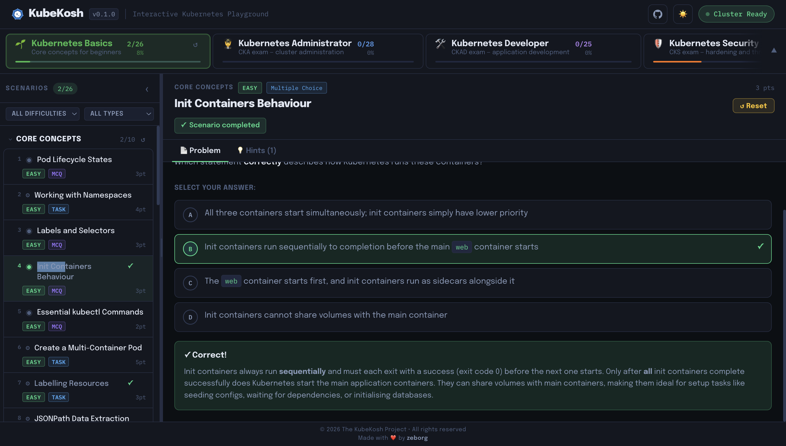

<div align="center">
  

  <h1>KubeKosh</h1>

  <p><strong>Samo-hostowane Laboratorium Kubernetes do Nauki przez Praktykę</strong></p>

  <p>
    <a href="https://hub.docker.com/r/zeborg/kubekosh"></a>
    
    
  </p>
</div>

---

> 🇵🇱 **Polska wersja językowa** projektu [zeborg/kubekosh](https://github.com/zeborg/kubekosh). Interfejs użytkownika przetłumaczony na język polski — pełna funkcjonalność bez zmian.

---

KubeKosh uruchamia prawdziwy klaster [K3s](https://k3s.io/) Kubernetes wewnątrz pojedynczego kontenera Docker i łączy go z terminalem przeglądarkowym oraz automatyczną weryfikacją scenariuszy — bez potrzeby posiadania konta w chmurze czy lokalnego klastra.

## Zrzuty ekranu

| | |
|---|---|
|  |  |
|  |  |
|  |  |
|  |  |

---

## Szybki Start

**Wymaganie:** [Docker](https://docs.docker.com/get-docker/)

```bash
docker run -itd --name kubekosh --privileged -p 7554:80 zeborg/kubekosh:latest
```

Otwórz **http://localhost:7554** — poczekaj ~30 sekund, aż wskaźnik *Klaster Gotowy* zmieni kolor na zielony.

> `--privileged` jest wymagane — K3s potrzebuje dostępu do przestrzeni nazw jądra i cgroups.

> **Ostrzeżenie bezpieczeństwa:** **Nie** wystawiaj tego kontenera publicznie. Używaj go wyłącznie na lokalnym komputerze — przeznaczony jest wyłącznie do celów edukacyjnych.

### Zachowywanie Postępów

```bash
docker run -itd --name kubekosh --privileged -p 7554:80 \
  -v <twój_katalog>:/data zeborg/kubekosh:latest
```

Postępy są przechowywane w SQLite pod ścieżką `/data/progress.db` wewnątrz kontenera. Zamontuj lokalny katalog do `/data`, aby zachować postępy po restarcie kontenera.

### Budowanie ze Źródeł

```bash
docker build -t kubekosh .
# wieloplatformowe
docker buildx build --platform linux/amd64,linux/arm64 -t kubekosh .
```

---

## Zawartość

| Zestaw | Skupienie | Tryb Egzaminu |
|---|---|---|
| 🌱 Podstawy Kubernetes | Podstawowe pojęcia | 60 min |
| 🧑‍✈️ Administrator Kubernetes | CKA | 120 min |
| 🛠️ Deweloper Kubernetes | CKAD | 120 min |
| 🛡️ Bezpieczeństwo Kubernetes | CKS | 120 min |

**Typy scenariuszy:**
- **Zadanie** — Praktyczne wyzwanie w żywym terminalu. Kliknij **Weryfikacja** w celu automatycznego sprawdzenia stanu klastra.
- **Wybór wielokrotny** — Pytanie wielokrotnego wyboru ze szczegółowym wyjaśnieniem po odpowiedzi.

### Aliasy Powłoki

Terminal jest wstępnie skonfigurowany z:

| Alias | Odpowiada |
|---|---|
| `k` | `kubectl` |
| `kg` | `kubectl get` |
| `kd` | `kubectl describe` |
| `krm` | `kubectl delete` |
| `kgp` | `kubectl get pods` |
| `kga` | `kubectl get pods --all-namespaces` |
| `kgd` | `kubectl get deployments` |
| `kgs` | `kubectl get services` |
| `kgn` | `kubectl get nodes` |
| `kgns` | `kubectl get namespaces` |
| `kdp` | `kubectl describe pod` |
| `kaf` | `kubectl apply -f` |
| `kdf` | `kubectl delete -f` |
| `kex` | `kubectl exec -it` |
| `klogs` | `kubectl logs` |
| `kns <ns>` | `kubectl config set-context --current --namespace=<ns>` |
| `kctx <ctx>` | `kubectl config use-context <ctx>` |

---

## Architektura

| Komponent | Technologia |
|---|---|
| Frontend | React + Vite, `xterm.js` |
| Backend | Node.js / Express, `node-pty` WebSocket PTY |
| Klaster | K3s (jeden węzeł, w kontenerze) |
| Proxy | nginx na porcie kontenera `80`, mapowany na port hosta `7554` |
| Baza danych | SQLite (`better-sqlite3`) pod `/data/progress.db` |

Wszystko działa wewnątrz **jednego obrazu Docker** zarządzanego przez `scripts/entrypoint.sh`.

---

## Układ Repozytorium

```
scenarios/
├── data/             # Jeden plik JSON na scenariusz  -> <id-scenariusza>.json
├── bundles/          # Jeden plik JSON na zestaw      -> <id-zestawu>.json
└── SCHEMA.md         # Pełna dokumentacja schematu

backend/
└── server.js         # Express API + WebSocket PTY

frontend/
└── src/              # React + Vite SPA

scripts/
├── entrypoint.sh     # Start kontenera (k3s -> API -> nginx)
└── nginx.conf        # Konfiguracja odwrotnego proxy
```

---

## Wkład w Projekt

Wkład w projekty open-source sprawia, że rosną — każdy wkład się liczy, duży czy mały. **Dziękujemy za poświęcony czas!**

### Dodawanie Scenariuszy

Każdy scenariusz to pojedynczy plik JSON w katalogu `scenarios/data`; każdy zestaw to plik JSON w `scenarios/bundles`. Zobacz [`scenarios/SCHEMA.md`](scenarios/SCHEMA.md) dla pełnego schematu.

**Lista kontrolna dla zadań:**
- `validation.commands` — tylko idempotentne komendy `kubectl`
- `setup_commands` / `teardown_commands` — tylko `kubectl` lub natywne komendy Ubuntu

**Lista kontrolna dla WW:**
- `correct_option` musi odpowiadać jednemu z wartości `options[].id`
- Zawsze dołącz `explanation`

### Pamięć Podręczna i Gorące Przeładowanie

Scenariusze i zestawy są przechowywane w pamięci podręcznej. Aby zaktualizować je bez przebudowywania obrazu:

1. **Zamontuj katalog scenariuszy:**
   ```bash
   docker run --rm -itd --privileged -p 7554:80 --name kubekosh -v <ścieżka_do_scenarios>:/app/scenarios zeborg/kubekosh:latest
   ```
2. **Przeładuj pamięć podręczną:** Kliknij przycisk **↻** w prawym górnym rogu lub wywołaj API:
   ```bash
   curl -X POST http://localhost:7554/api/cache/reload
   ```

### Przepływ Pracy

```bash
# 1. Sforkuj repo na GitHub, a następnie sklonuj swój fork
git clone https://github.com/<twoja-nazwa-użytkownika>/kubekosh.git
cd kubekosh

# 2. Utwórz gałąź
git checkout -b feat/mój-scenariusz

# 3. Dodaj nowy plik scenariusza
cp scenarios/data/deploy-nginx.json scenarios/data/mój-nowy-scenariusz.json
vim scenarios/data/mój-nowy-scenariusz.json

# 4. Dodaj ID scenariusza do odpowiedniego zestawu
vim scenarios/bundles/k8s-basics.json

# 5. Zbuduj i przetestuj lokalnie
docker build -t kubekosh . && docker run --rm -itd --privileged -p 7554:80 --name kubekosh kubekosh

# 6. Zatwierdź i wypchnij do swojego forka
git add scenarios/data/mój-nowy-scenariusz.json scenarios/bundles/k8s-basics.json
git commit -m "feat: dodaj mój-nowy-scenariusz do zestawu k8s-basics"
git push -u origin feat/mój-scenariusz
```

Otwórz Pull Request ze swojej gałęzi forka wobec `main`.

---

## Licencja

Licencja Apache 2.0 — zobacz [LICENSE](LICENSE).
